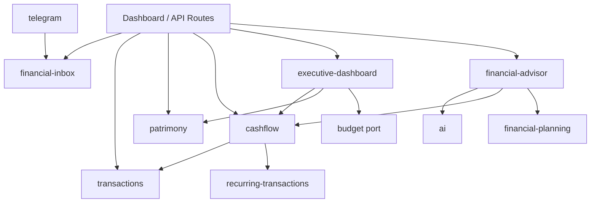

# Visão de Arquitetura — Vorcaro Finance Control

Padrão: **Domain → Application → Infrastructure → Web** (ports & adapters), com rotas finas em `src/app/api` e UI em `src/components`.

```
src/
├── app/              # Next.js App Router (API + páginas)
├── components/       # UI por domínio
├── lib/              # adapters, parsers, factories de serviço
├── modules/          # regras de negócio
└── types/            # DTOs e schemas Zod compartilhados
```

### Navegação UI (Sprint 14.8)

| Aspecto | Detalhe |
|---------|---------|
| **Config** | `src/lib/navigation/dashboard-nav.ts` — `DASHBOARD_NAV_GROUPS`, `VORCARO_HUB_CARDS` |
| **Shell** | `src/components/dashboard/sidebar.tsx` — `prefetch={false}`, `exactMatch` no hub |
| **Hub Vorcaro** | `/dashboard/vorcaro` → cards para chat, ações, pendências, timeline, insights |
| **Rotas** | Todas as rotas anteriores preservadas; submódulos Vorcaro removidos do menu principal |

### Autoconsciência conversacional (Sprint 14.9.2)

| Aspecto | Detalhe |
|---------|---------|
| **Context** | `VorcaroConversationContextService` — topic lock, stage |
| **Critic** | `VorcaroResponseCriticService` — relevância, ferramenta, score |
| **Pipeline** | `VorcaroConversationSelfCorrectionService` — critic + regenerate |
| **Listagens** | `category_list`, `card_list` — respostas simples sem análise |
| **Debug** | `GET /api/vorcaro/debug/diagnostics` (admin) |

### Auditoria consultiva de categorias (Sprint 14.9.3)

| Aspecto | Detalhe |
|---------|---------|
| **Consultivo** | `VorcaroConsultativeResponseService` — modos ANALYTICAL / CONSULTATIVE / EXECUTIVE |
| **Health** | `computeTaxonomyHealthScore`, `buildTopImprovements` em `category-audit-health.ts` |
| **Exemptions** | `category-audit-exemptions.ts` — investimentos, receita/despesa, especialização |
| **Memória** | `CategoryAuditPreferenceMemoryService` — rejeições na sessão (sem Prisma) |
| **UI** | `/dashboard/categories/audit` — Health Score, top 5; códigos técnicos em painel debug |

### Taxonomia de categorias (Sprint 14.8)

| Aspecto | Detalhe |
|---------|---------|
| **Fonte** | `src/lib/categories/vorcaro-category-taxonomy.ts` |
| **Seed** | `seedCategoryTaxonomyForUser` — idempotente, não sobrescreve customizadas |
| **Provisionamento** | `prisma db seed` + primeiro login (`src/lib/auth.ts`) |
| **Aliases** | `category-aliases.ts` — compatibilidade regras/inbox |

---

## `src/modules/` — mapa principal

### `ai`

| Aspecto | Detalhe |
|---------|---------|
| **Serviços** | `AiRouterService` |
| **Repositórios** | Nenhum (HTTP para provedores) |
| **Providers** | `GroqAiProvider`, `GeminiAiProvider`, `OpenRouterAiProvider` |
| **Port** | `AiProviderPort` |
| **Endpoints** | Indireto via `financial-advisor` |
| **Dependências** | Variáveis de ambiente (`GROQ_*`, `GEMINI_*`, `OPENROUTER_*`) |

### `financial-consultant` (Sprint 9.5 / 9.5A)

| Aspecto | Detalhe |
|---------|---------|
| **Serviços** | `IntelligentAdvisorService`, detectores, `AdvisorActionEnrichmentService`, `AdvisorRecommendationMemoryService`, `AdvisorRecommendationHashService`, guardrails de linguagem |
| **Persistência** | `AdvisorRecommendationState` — memória de dismiss/click por `recommendationHash` (SHA-256 determinístico, sem texto de IA) |
| **Endpoints** | `GET /api/advisor/consultation`, `POST .../actions/:hash/dismiss`, `click`, `reactivate` |
| **Segurança** | Upsert sempre com `userId` da sessão; hash registrado para outro usuário → 403; hash inválido → 400 |
| **Ciclo de vida** | Click mantém `PENDING` (card visível); dismiss oculta 30 dias; após `dismissedUntil` a ação pode voltar se o motor detectar de novo |
| **Dependências** | `financial-alerts`, `receivables`, `commitments`, `financial-planning`, `cashflow`, Prisma |

### `financial-advisor`

| Aspecto | Detalhe |
|---------|---------|
| **Serviços** | `FinancialAdvisorService`, `FinancialDataAggregatorService`, `FinancialInsightsService` |
| **Repositórios** | Prisma direto no agregador |
| **Endpoints** | `POST /api/advisor/ask`, `GET /api/advisor/insights`, `GET /api/advisor/consultation` |
| **Dependências** | `ai`, `financial-consultant`, `cashflow`, `financial-planning`, `financial-alerts`, `commitments`, Prisma |

### `financial-memory` (Sprint 12)

| Aspecto | Detalhe |
|---------|---------|
| **Serviços** | `FinancialTimelineEngineService`, `FinancialComparisonService`, `FinancialEvolutionProfileService`, `FinancialAchievementService`, `EvolutionHealthScoreService`, `FinancialMemoryQueryService` |
| **Persistência** | `FinancialTimelineEvent` (fingerprint), `FinancialMetricSnapshot`, `FinancialAchievement` |
| **Perfil evolução** | `FinancialEvolutionProfileService` — somente leitura/cálculo, sem tabela |
| **Endpoints** | `GET /api/vorcaro/timeline`, `evolution`, `achievements`; `POST /api/cron/financial-timeline` |
| **Dependências** | `financial-consultant`, `patrimony`, `financial-planning`, `executive-dashboard`, Prisma |
| **Observabilidade** | `timeline_events_created`, `evolution_queries`, `achievement_unlocked`, `trend_detected` |

### `vorcaro` (Sprint 10.5 / 11 / 11.1 / 12 / 13)

| Aspecto | Detalhe |
|---------|---------|
| **Serviços** | `VorcaroMessagingService`, `VorcaroConversationService`, `VorcaroContextAggregatorService`, `VorcaroConversationMemoryService`, `VorcaroPromptBuilderService`, **`VorcaroIntentEngineService`**, **`VorcaroToolResolverService`**, **`VorcaroToolCallingService`**, **`RulesAutomationTool`**, **`VorcaroActionProposalService`**, **`VorcaroActionInterpreterService`**, **`VorcaroActionExecutorService`** |
| **Fluxo chat** | Confirmação de proposta (Sprint 13) → Intent Engine → Tool Resolver → ferramentas → propostas PENDING + Formatter FIA; fallback LLM |
| **Execução assistida** | Assist → Confirm → Execute; execução = `targetUrl` apenas (sem mutação financeira) |
| **Repositórios** | `PrismaVorcaroConversationRepository`, `PrismaVorcaroMessageHistoryRepository`, `PrismaVorcaroPreferenceRepository`, **`PrismaVorcaroActionProposalRepository`** |
| **Endpoints** | `POST /api/vorcaro/chat`, `/api/vorcaro/conversations`, `/api/vorcaro/preferences`, **`/api/vorcaro/actions`** |
| **Dependências** | `ai`, `financial-advisor`, `financial-consultant`, `notifications`, `financial-inbox` (regras), Prisma |
| **Observabilidade** | Intent: `intent_detected`, `tool_called`, … — Ações: `action_proposal_*`, `action_executed`, `action_failed` |

### `vorcaro/actions` (Sprint 13)

| Aspecto | Detalhe |
|---------|---------|
| **Persistência** | `VorcaroActionProposal` — status, `expiresAt` 15 min, `payload.fingerprint` |
| **Endpoints** | `GET/POST /api/vorcaro/actions/:id/approve|reject|execute` |
| **UI** | `/dashboard/vorcaro/actions` |
| **Telegram** | `sim`/`não`/etc. via mesmo fluxo de chat |

### `cashflow`

| Aspecto | Detalhe |
|---------|---------|
| **Serviços** | `CashflowProjectionService` |
| **Repositórios** | Queries Prisma internas ao serviço |
| **Endpoints** | `GET /api/cashflow/projection` |
| **Dependências** | Prisma, transações, recorrências, cartões, consórcios, passivos |

### `financial-alerts` (Sprint 9)

| Aspecto | Detalhe |
|---------|---------|
| **Serviços** | `FinancialAlertEngineService`, `FinancialAlertRulesEvaluator`, `FinancialAlertQueryService` |
| **Repositórios** | `PrismaFinancialAlertRepository` |
| **Endpoints** | `GET /api/alerts`, `GET /api/alerts/summary`, `PATCH /api/alerts/[id]`, `POST /api/alerts/bulk-patch`, `POST /api/cron/financial-alerts` |
| **Dependências** | `commitments`, `receivables`, `cashflow`, `financial-planning`, `executive-dashboard` (renda do mês) |
| **Idempotência** | `fingerprint` + `@@unique([userId, fingerprint])` |

### `notifications` (Sprint 10)

| Aspecto | Detalhe |
|---------|---------|
| **Serviços** | `NotificationCenterService`, `NotificationQueryService`, `NotificationDigestService`, `NotificationTelegramDeliveryService`, `NotificationEventBridgeService` |
| **Repositórios** | `PrismaNotificationRepository`, `PrismaNotificationPreferenceRepository` |
| **Endpoints** | `GET /api/notifications`, `GET /api/notifications/summary`, `PATCH /api/notifications/[id]`, `GET/PATCH /api/notifications/preferences`, cron digests |
| **Dependências** | `financial-alerts`, `telegram`, Prisma |
| **Canais** | Dashboard (instantâneo), Telegram (MarkdownV2, rate limit 3/h), Digest |

### `commitments` (Sprint 8)

| Aspecto | Detalhe |
|---------|---------|
| **Serviços** | `MonthlyCommitmentsService`, `commitment-projection.helpers` |
| **Repositórios** | Nenhum (read model sobre Prisma existente) |
| **Endpoints** | `GET /api/commitments/monthly` |
| **Dependências** | `recurring-transactions`, `installments`, `receivables`, `patrimony`, `consortium`, transações |
| **Nota** | Complementa cashflow com visão mensal explicável; deduplicação mínima documentada no serviço |

### `patrimony`

| Aspecto | Detalhe |
|---------|---------|
| **Serviços** | `PatrimonyAccountingService`, `LiabilityAmortizationService`, use cases em `patrimony.use-cases.ts` |
| **Repositórios** | `prisma-patrimony.repositories.ts`, `prisma-patrimony-unit-of-work.ts` |
| **Port** | `PatrimonyUnitOfWorkPort` |
| **Endpoints** | `/api/patrimony/*` |
| **Dependências** | Prisma, `transactions` (vínculo opcional) |

### `consortium`

| Aspecto | Detalhe |
|---------|---------|
| **Serviços** | `ConsortiumService` |
| **Repositórios** | Prisma no serviço |
| **Endpoints** | `/api/consortiums`, transações patrimoniais de consórcio |
| **Dependências** | `patrimony`, `recurring-transactions` |

### `financial-inbox` (Inbox)

| Aspecto | Detalhe |
|---------|---------|
| **Serviços** | Ingest, process, confirm, bulk, rules; `GeminiAiService` |
| **Repositórios** | `PrismaInboxRepository`, `PrismaExtractionResultRepository`, `PrismaUserLearningPatternRepository` |
| **Ports** | `InboxRepositoryPort`, `AiServicePort`, `ExtractionResultRepositoryPort` |
| **Endpoints** | `/api/inbox/*`, `/api/inbox/import/*` |
| **Dependências** | `transactions`, Gemini (legado), BullMQ worker |

### `recurring-transactions`

| Aspecto | Detalhe |
|---------|---------|
| **Serviços** | `ProcessRecurringTransactionsUseCase`, CRUD use cases |
| **Repositórios** | `PrismaRecurringTransactionRepository` |
| **Port** | `RecurringTransactionPort` |
| **Endpoints** | `/api/config/lancamentos-recorrentes/*`, `POST /api/transactions/recurring/process` |
| **Dependências** | `transactions`, `financial` (datas de cartão) |

### `telegram`

| Aspecto | Detalhe |
|---------|---------|
| **Serviços** | `ProcessTelegramUpdateService` |
| **Repositórios** | Prisma (`TelegramConnection`, `TelegramConnectCode`) |
| **Endpoints** | `/api/telegram/webhook`, `/api/telegram/integration` |
| **Dependências** | `financial-inbox` (ingestão), Auth por código |

### `financial-planning` (Sprint 6 — concluída)

| Aspecto | Detalhe |
|---------|---------|
| **Serviços** | `FinancialGoalStrategyService`, `FinancialGoalViabilityService`, `FinancialGoalPrioritizationService`, `FinancialGoalRecommendationService`, `FinancialGoalProjectionService`, `FinancialPlanningService` |
| **Repositórios** | Prisma em `financial-planning/infrastructure` |
| **Endpoints** | `GET/POST /api/planning/goals`, `PATCH/DELETE /api/planning/goals/[id]` |
| **UI** | `/dashboard/planning`, bloco no dashboard executivo |
| **Dependências** | `cashflow` (margem 30d na viabilidade), Prisma `FinancialGoal` |

### `installments` (Sprint 7 — Fase 1)

| Aspecto | Detalhe |
|---------|---------|
| **Serviços** | `InstallmentReadModelService` |
| **Repositórios** | `PrismaInstallmentReadRepository` |
| **Endpoints** | `GET /api/installments`, `GET /api/installments/[groupId]` |
| **UI** | `/dashboard/installments` |
| **Dependências** | Prisma `Transaction` (sem migration) |

**Fase 2:** `getSummary` no Advisor; `getFutureCommitments` no Cashflow (`INSTALLMENT`); insights determinísticos; snapshot no dashboard executivo.

---

## Módulos de suporte (referência)

| Módulo | Papel |
|--------|-------|
| `transactions` | CRUD, estorno, bulk update/delete |
| `financial-instruments` | Contas e cartões (config) |
| `financial-config` | Categorias |
| `executive-dashboard` | Agregação do dashboard |
| `budget` | Port de overview orçamentário |
| `financial` | Datas efetivas, builder de transação de cartão |
| `financial-planning` | Metas: estratégia, viabilidade, priorização, recomendação (`FinancialPlanningService`) |
| `installments` | Read model de parcelamentos (`InstallmentReadModelService`) |

---

## Fluxo de dependências (alto nível)



---

## Factories em `src/lib/api`

| Factory | Uso |
|---------|-----|
| `buildExecutiveDashboardService()` | Dashboard executivo |
| `buildCashflowProjectionService(prisma)` | Projeção de caixa |
| `buildFinancialPlanningService()` | Metas (Sprint 6) |
| `buildInstallmentReadModelService()` | Parcelamentos (Sprint 7 Fase 1) |

Rotas **não** instanciam regras complexas inline; delegam a use cases/serviços dos módulos.

---

## Segurança e isolamento

- Toda rota autenticada usa `auth()` → `session.user.id`.
- Webhook Telegram valida `X-Telegram-Bot-Api-Secret-Token` (ou token legado na rota antiga).
- Body de APIs **não** aceita `userId` do cliente (ex.: `POST /api/advisor/ask`).
