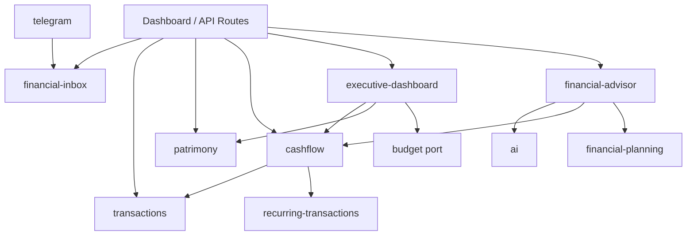

# Visão de Arquitetura — Vorcaro Finance Control

Padrão: **Domain → Application → Infrastructure → Web** (ports & adapters), com rotas finas em `src/app/api` e UI em `src/components`.

```
src/
├── app/              # Next.js App Router (API + páginas)
├── components/       # UI por domínio
├── lib/              # adapters, parsers, factories de serviço
├── modules/          # regras de negócio
└── types/            # DTOs e schemas Zod compartilhados
```

---

## `src/modules/` — mapa principal

### `ai`

| Aspecto | Detalhe |
|---------|---------|
| **Serviços** | `AiRouterService` |
| **Repositórios** | Nenhum (HTTP para provedores) |
| **Providers** | `GroqAiProvider`, `GeminiAiProvider`, `OpenRouterAiProvider` |
| **Port** | `AiProviderPort` |
| **Endpoints** | Indireto via `financial-advisor` |
| **Dependências** | Variáveis de ambiente (`GROQ_*`, `GEMINI_*`, `OPENROUTER_*`) |

### `financial-advisor`

| Aspecto | Detalhe |
|---------|---------|
| **Serviços** | `FinancialAdvisorService`, `FinancialDataAggregatorService`, `FinancialInsightsService` |
| **Repositórios** | Prisma direto no agregador |
| **Endpoints** | `POST /api/advisor/ask`, `GET /api/advisor/insights` |
| **Dependências** | `ai`, `cashflow`, `financial-planning`, `financial-alerts`, `commitments`, Prisma |

### `cashflow`

| Aspecto | Detalhe |
|---------|---------|
| **Serviços** | `CashflowProjectionService` |
| **Repositórios** | Queries Prisma internas ao serviço |
| **Endpoints** | `GET /api/cashflow/projection` |
| **Dependências** | Prisma, transações, recorrências, cartões, consórcios, passivos |

### `financial-alerts` (Sprint 9)

| Aspecto | Detalhe |
|---------|---------|
| **Serviços** | `FinancialAlertEngineService`, `FinancialAlertRulesEvaluator`, `FinancialAlertQueryService` |
| **Repositórios** | `PrismaFinancialAlertRepository` |
| **Endpoints** | `GET /api/alerts`, `GET /api/alerts/summary`, `PATCH /api/alerts/[id]`, `POST /api/alerts/bulk-patch`, `POST /api/cron/financial-alerts` |
| **Dependências** | `commitments`, `receivables`, `cashflow`, `financial-planning`, `executive-dashboard` (renda do mês) |
| **Idempotência** | `fingerprint` + `@@unique([userId, fingerprint])` |

### `commitments` (Sprint 8)

| Aspecto | Detalhe |
|---------|---------|
| **Serviços** | `MonthlyCommitmentsService`, `commitment-projection.helpers` |
| **Repositórios** | Nenhum (read model sobre Prisma existente) |
| **Endpoints** | `GET /api/commitments/monthly` |
| **Dependências** | `recurring-transactions`, `installments`, `receivables`, `patrimony`, `consortium`, transações |
| **Nota** | Complementa cashflow com visão mensal explicável; deduplicação mínima documentada no serviço |

### `patrimony`

| Aspecto | Detalhe |
|---------|---------|
| **Serviços** | `PatrimonyAccountingService`, `LiabilityAmortizationService`, use cases em `patrimony.use-cases.ts` |
| **Repositórios** | `prisma-patrimony.repositories.ts`, `prisma-patrimony-unit-of-work.ts` |
| **Port** | `PatrimonyUnitOfWorkPort` |
| **Endpoints** | `/api/patrimony/*` |
| **Dependências** | Prisma, `transactions` (vínculo opcional) |

### `consortium`

| Aspecto | Detalhe |
|---------|---------|
| **Serviços** | `ConsortiumService` |
| **Repositórios** | Prisma no serviço |
| **Endpoints** | `/api/consortiums`, transações patrimoniais de consórcio |
| **Dependências** | `patrimony`, `recurring-transactions` |

### `financial-inbox` (Inbox)

| Aspecto | Detalhe |
|---------|---------|
| **Serviços** | Ingest, process, confirm, bulk, rules; `GeminiAiService` |
| **Repositórios** | `PrismaInboxRepository`, `PrismaExtractionResultRepository`, `PrismaUserLearningPatternRepository` |
| **Ports** | `InboxRepositoryPort`, `AiServicePort`, `ExtractionResultRepositoryPort` |
| **Endpoints** | `/api/inbox/*`, `/api/inbox/import/*` |
| **Dependências** | `transactions`, Gemini (legado), BullMQ worker |

### `recurring-transactions`

| Aspecto | Detalhe |
|---------|---------|
| **Serviços** | `ProcessRecurringTransactionsUseCase`, CRUD use cases |
| **Repositórios** | `PrismaRecurringTransactionRepository` |
| **Port** | `RecurringTransactionPort` |
| **Endpoints** | `/api/config/lancamentos-recorrentes/*`, `POST /api/transactions/recurring/process` |
| **Dependências** | `transactions`, `financial` (datas de cartão) |

### `telegram`

| Aspecto | Detalhe |
|---------|---------|
| **Serviços** | `ProcessTelegramUpdateService` |
| **Repositórios** | Prisma (`TelegramConnection`, `TelegramConnectCode`) |
| **Endpoints** | `/api/telegram/webhook`, `/api/telegram/integration` |
| **Dependências** | `financial-inbox` (ingestão), Auth por código |

### `financial-planning` (Sprint 6 — concluída)

| Aspecto | Detalhe |
|---------|---------|
| **Serviços** | `FinancialGoalStrategyService`, `FinancialGoalViabilityService`, `FinancialGoalPrioritizationService`, `FinancialGoalRecommendationService`, `FinancialGoalProjectionService`, `FinancialPlanningService` |
| **Repositórios** | Prisma em `financial-planning/infrastructure` |
| **Endpoints** | `GET/POST /api/planning/goals`, `PATCH/DELETE /api/planning/goals/[id]` |
| **UI** | `/dashboard/planning`, bloco no dashboard executivo |
| **Dependências** | `cashflow` (margem 30d na viabilidade), Prisma `FinancialGoal` |

### `installments` (Sprint 7 — Fase 1)

| Aspecto | Detalhe |
|---------|---------|
| **Serviços** | `InstallmentReadModelService` |
| **Repositórios** | `PrismaInstallmentReadRepository` |
| **Endpoints** | `GET /api/installments`, `GET /api/installments/[groupId]` |
| **UI** | `/dashboard/installments` |
| **Dependências** | Prisma `Transaction` (sem migration) |

**Fase 2:** `getSummary` no Advisor; `getFutureCommitments` no Cashflow (`INSTALLMENT`); insights determinísticos; snapshot no dashboard executivo.

---

## Módulos de suporte (referência)

| Módulo | Papel |
|--------|-------|
| `transactions` | CRUD, estorno, bulk update/delete |
| `financial-instruments` | Contas e cartões (config) |
| `financial-config` | Categorias |
| `executive-dashboard` | Agregação do dashboard |
| `budget` | Port de overview orçamentário |
| `financial` | Datas efetivas, builder de transação de cartão |
| `financial-planning` | Metas: estratégia, viabilidade, priorização, recomendação (`FinancialPlanningService`) |
| `installments` | Read model de parcelamentos (`InstallmentReadModelService`) |

---

## Fluxo de dependências (alto nível)



---

## Factories em `src/lib/api`

| Factory | Uso |
|---------|-----|
| `buildExecutiveDashboardService()` | Dashboard executivo |
| `buildCashflowProjectionService(prisma)` | Projeção de caixa |
| `buildFinancialPlanningService()` | Metas (Sprint 6) |
| `buildInstallmentReadModelService()` | Parcelamentos (Sprint 7 Fase 1) |

Rotas **não** instanciam regras complexas inline; delegam a use cases/serviços dos módulos.

---

## Segurança e isolamento

- Toda rota autenticada usa `auth()` → `session.user.id`.
- Webhook Telegram valida `X-Telegram-Bot-Api-Secret-Token` (ou token legado na rota antiga).
- Body de APIs **não** aceita `userId` do cliente (ex.: `POST /api/advisor/ask`).
