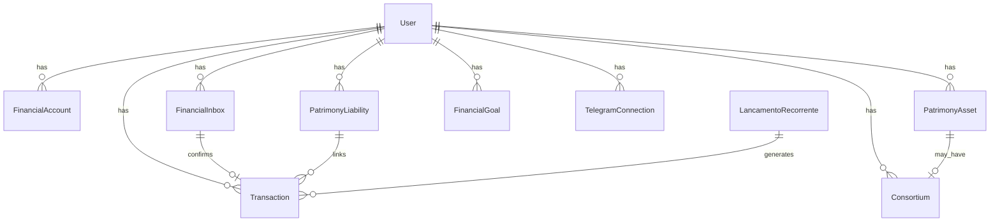

# Inventário de Banco de Dados — Vorcaro Finance Control

Fonte: `prisma/schema.prisma` (PostgreSQL, schema `public`).

**Totais:** 25 modelos · 24 enums

---

## Auth.js

### `User`

**Finalidade:** Usuário raiz; isolamento multitenant.  
**Relacionamentos:** Todos os domínios financeiros, Telegram, metas.

### `Account`, `Session`, `VerificationToken`

**Finalidade:** OAuth/sessão Auth.js padrão NextAuth.

---

## Domínio financeiro core

### `FinancialAccount`

**Finalidade:** Contas bancárias/carteiras com saldo `Decimal`.  
**Relacionamentos:** `User`, `Card`, `Transaction`, `LancamentoRecorrente`.

### `Card`

**Finalidade:** Cartões de crédito/débito, fatura (closing/due day).  
**Relacionamentos:** `User`, `FinancialAccount?`, `Transaction`, recorrências.

### `Category`

**Finalidade:** Plano de contas (receita/despesa), hierarquia opcional.  
**Relacionamentos:** `User`, `Transaction`, `LancamentoRecorrente`.

### `PaymentMethod`

**Finalidade:** PIX, cartão, boleto, etc.  
**Relacionamentos:** `User`, `Transaction`, recorrências.

### `Transaction`

**Finalidade:** Lançamento financeiro (extrato); suporta parcelas, cartão, recorrência, passivo.  
**Relacionamentos:** `User`, conta, categoria, cartão, `FinancialInbox?`, `PatrimonyLiability?`, `PatrimonyTransaction[]`.

**Parcelamento (base para Sprint 7):** `installments`, `installmentGroup` (índice), `currentInstallment`, `totalInstallments`, `numeroParcela`, `totalParcelas`, `idGrupoParcelamento`; cartão: `dataCompra`, `dataVencimentoFatura`, `cardId`. Não há tabela `InstallmentPlan` — agregação futura sobre estas colunas. Ver `docs/installments-readiness.md`.

---

## Recorrências

### `LancamentoRecorrente`

**Finalidade:** Despesa/receita periódica com próxima execução e alocações padrão (`defaultAllocations` JSON).  
**Relacionamentos:** `User`, categoria, conta, forma pagamento, cartão opcional, passivo opcional, `Consortium[]`.

**Enums:** `FrequenciaRecorrencia`, `TipoLancamentoRecorrente`

---

## Caixa Financeira (Inbox)

### `FinancialInbox`

**Finalidade:** Item bruto antes de virar transação.  
**Relacionamentos:** `User`, `Attachment[]`, `ExtractionResult[]`, `Transaction?`.

### `Attachment`

**Finalidade:** Arquivo anexo (áudio, imagem, PDF).  
**Relacionamentos:** `FinancialInbox`, `ExtractionResult?`.

### `ExtractionResult`

**Finalidade:** Resultado estruturado da IA/OCR por item.  
**Relacionamentos:** `FinancialInbox`, `Attachment?`.

**Enums:** `InboxStatus`, `InboxChannel`

---

## Automação / aprendizado

### `UserRule`

**Finalidade:** Regras condicionais (JSON condition/action).  
**Relacionamentos:** `User`.

### `UserLearningPattern`

**Finalidade:** Padrões aprendidos de categorização.  
**Relacionamentos:** `User`.

---

## Patrimônio

### `PatrimonyAsset`

**Finalidade:** Ativos (imóvel, veículo, investimento, consórcio como ativo, etc.).  
**Relacionamentos:** `User`, `PatrimonyLiability?` (vínculo), `PatrimonyTransaction[]`, `Consortium?`.

### `PatrimonyLiability`

**Finalidade:** Passivos com saldo, juros e datas.  
**Relacionamentos:** `User`, ativos vinculados, movimentações, transações, recorrências.

### `PatrimonyTransaction`

**Finalidade:** Movimentação patrimonial (aporte, amortização, correção, etc.).  
**Relacionamentos:** `User`, ativo/passivo opcional, `Transaction?` principal.

**Enums:** `AssetType`, `LiabilityType`, `PatrimonyTxType`

---

## Consórcios

### `Consortium`

**Finalidade:** Contrato de consórcio, parcelas, contemplação, vínculo com ativo/recorrência.  
**Relacionamentos:** `User`, `PatrimonyAsset?`, `LancamentoRecorrente?`.

**Enums:** `ConsortiumType`, `ConsortiumStatus`

---

## Planejamento (Sprint 6)

### `FinancialGoal`

**Finalidade:** Meta financeira com valor objetivo, aporte mensal opcional, data objetivo e status.  
**Relacionamentos:** `User`.

**Enums:** `FinancialGoalType`, `GoalPriority`, `GoalStatus`

---

## Telegram

### `TelegramConnection`

**Finalidade:** Chat Telegram vinculado ao usuário.  
**Relacionamentos:** `User` (único por `telegramChatId`).

### `TelegramConnectCode`

**Finalidade:** Código temporário `/connect` (expira em 15 min).  
**Relacionamentos:** `User`.

---

## Enums de domínio (resumo)

| Enum | Uso |
|------|-----|
| `AccountType` | Tipo de conta |
| `CardBrand`, `CardType` | Cartão |
| `CategoryType` | Receita/despesa |
| `TransactionType` | INCOME, EXPENSE, TRANSFER |
| `PaymentMethodType` | Forma de pagamento |
| `FrequenciaRecorrencia`, `TipoLancamentoRecorrente` | Recorrências |
| `InboxStatus`, `InboxChannel` | Caixa |
| `AssetType`, `LiabilityType`, `PatrimonyTxType` | Patrimônio |
| `ConsortiumType`, `ConsortiumStatus` | Consórcio |
| `FinancialGoalType`, `GoalPriority`, `GoalStatus` | Metas |
| Demais | Compatibilidade/aliases históricos no schema |

---

## Diagrama simplificado de relacionamentos

---

## Migrations ativas

1. `20260602152611_init_clean_schema`
2. `20260602163707_telegram_connections`
3. `20260602190420_financial_goals`

Legado: `prisma/migrations_archived_legacy/` — ver `docs/migrations-legacy-inventory.md`.
