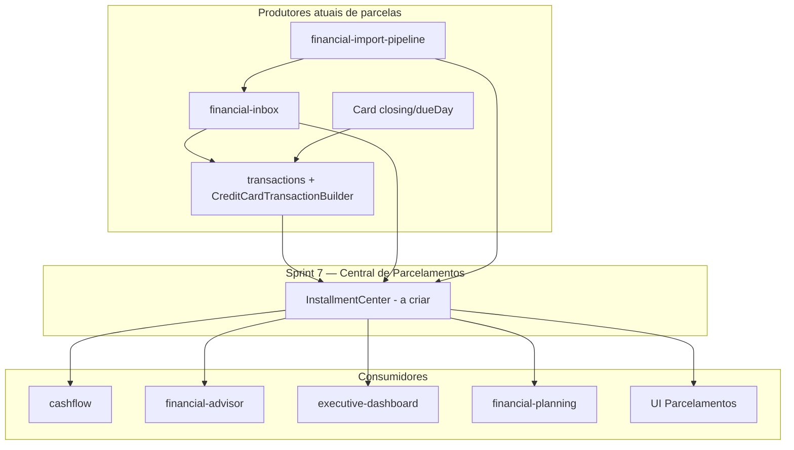

# Sprint 7 — Análise de impacto (Central de Parcelamentos)

**Objetivo da Sprint 7 (futura):** visão unificada de parcelamentos (cartão, importações, manuais) com comprometimento futuro, sem duplicidade e integração com fluxo, advisor e dashboard.

**Status deste documento:** preparação (Sprint 6.5) — **sem implementação**.

---

## Módulos que serão consumidores da Central de Parcelamentos

| Módulo | Papel como consumidor | Prioridade |
|--------|------------------------|------------|
| **Dashboard Executivo** | KPIs: parcelado total, restante, comprometimento futuro, por cartão/categoria | Alta |
| **Fluxo de Caixa (`cashflow`)** | Eventos futuros por parcela (hoje: `FATURA` por `dataVencimentoFatura`) | Alta |
| **IA Financeira (`financial-advisor`)** | Perguntas: faltam quantas parcelas, quanto pago/devo, vencimentos do mês | Alta |
| **Planejamento (`financial-planning`)** | Viabilidade de metas vs comprometimento parcelado futuro | Média |
| **Extrato & Lançamentos (`transactions`)** | Fonte de verdade atual; criação/edição parcelada | Alta (produtor + consumidor) |
| **Caixa Financeira (`financial-inbox`)** | Confirmação com `installments` / grupo | Alta (produtor) |
| **Importação (`financial-import-pipeline`)** | Detecção `N/M` em descrição (PDF/OFX/CSV) | Alta (produtor) |
| **Cartões (`financial-instruments` + `financial`)** | Fechamento/vencimento, `CreditCardTransactionBuilder` | Alta (produtor) |
| **Consórcios (`consortium`)** | Parcelas de consórcio (domínio paralelo; não confundir) | Baixa (fronteira) |
| **Patrimônio / Passivos** | Parcelas de financiamento (`liabilityId`, origem FINANCIAMENTO no cashflow) | Média (fronteira) |
| **Telegram** | Ingestão pode gerar compras parceladas indiretamente | Baixa |

---

## Mapa de dependências (quem depende de quem)

---

## Impacto por área solicitada

### Cartões

- **Tabelas:** `Card` (`closingDay`, `dueDay`, `creditLimit`), `Transaction` (`cardId`, `dataVencimentoFatura`).
- **Serviços:** `CreditCardTransactionBuilderService`, `resolveCardBillingConfig`, `calculateCreditCardCashDate`.
- **Impacto Sprint 7:** central deve agrupar por `idGrupoParcelamento` / `installmentGroup` e alinhar vencimentos à fatura.

### Faturas

- **Origem:** não há entidade `Invoice`; fatura = transações de cartão com `dataVencimentoFatura`.
- **Cashflow:** eventos `origem: FATURA` na data de vencimento.
- **Impacto Sprint 7:** possível camada `InvoiceSummary` derivada ou entidade explícita (decisão de design na Sprint 7).

### Inbox

- Extração IA pode trazer `installments`; confirmação repassa a `create-transaction` com `parcelas`.
- **Impacto:** vincular `inboxItemId` → grupo de parcelamento na central.

### Importação PDF / OFX

- **PDF/OFX/CSV:** `extractInstallments()` em `financial-import-pipeline.ts` (padrão `3/12` na descrição).
- **Impacto:** deduplicação e normalização na central (risco alto de duplicar com confirmação manual).

### Fluxo futuro

- Usa `Transaction` futuras + recorrências + consórcios + passivos.
- Parcelas de cartão entram como **uma linha por vencimento de fatura**, não como plano de parcelamento explícito.
- **Impacto:** central deve alimentar timeline com parcelas individuais ou agregadas (decisão de produto).

### Advisor

- Agregador lê transações e consórcios; **não** há bloco dedicado a parcelamentos.
- **Impacto:** novo bloco markdown + `usedSources` na Sprint 7.

### Planejamento financeiro

- `FinancialGoalViabilityService` usa margem 30d do cashflow.
- **Impacto:** comprometimento parcelado futuro deve reduzir margem livre exibida nas metas.

### Dashboard executivo

- Bloco `planning` existente; sem KPIs de parcelamento.
- **Impacto:** novo card ou seção no DTO executivo.

---

## Módulos com baixo ou nenhum impacto direto

- `ai` (router) — indireto via advisor
- `telegram` — apenas ingestão
- `budget` — pode cruzar categorias depois
- Auth / config cadastros — sem mudança estrutural prevista

---

## Ordem sugerida de implementação (Sprint 7)

1. Modelo de domínio + leitura agregada (read model) sobre `Transaction`
2. API `/api/installments` (ou sub-recurso) + testes de ownership
3. Integração `CashflowProjectionService`
4. Integração `FinancialDataAggregatorService`
5. UI Central de Parcelamentos + card executivo
6. Ajuste fino em importação (dedupe)
